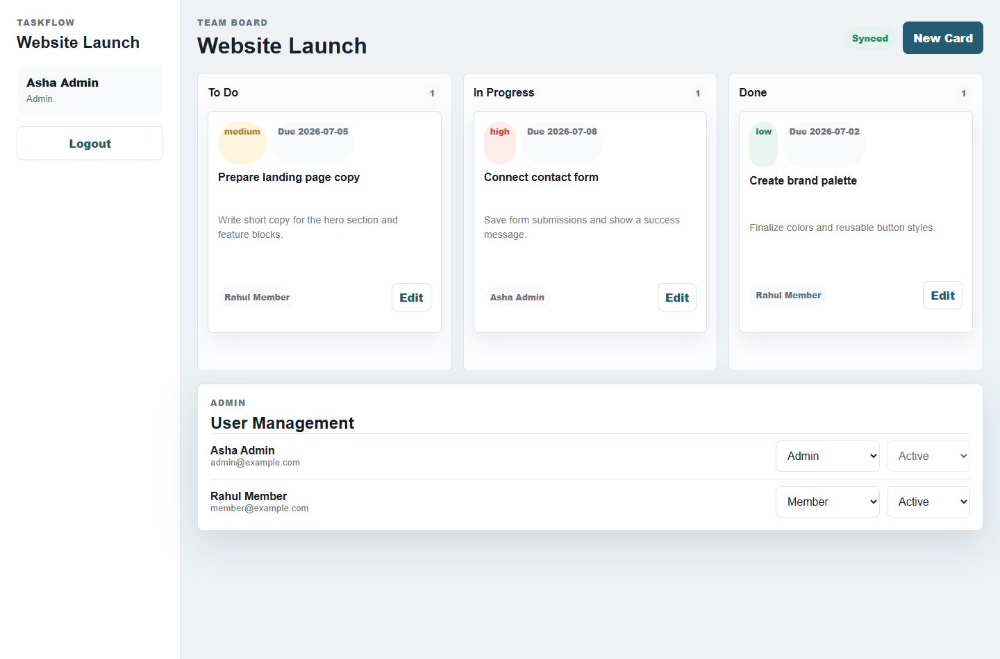
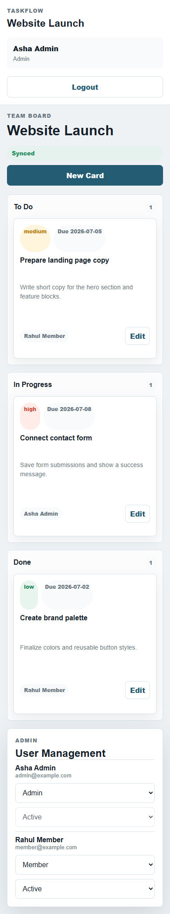

# TaskFlow Board

TaskFlow Board is a lightweight multi-user task management system built for the Azentrix Digital Services Full Stack Developer Intern Task 2. It works like a mini Trello board for small teams.

## Features

- User registration and login with secure session cookies
- Admin and member roles
- Board with To Do, In Progress, and Done columns
- Draggable task cards
- Cards include title, description, assignee, due date, and priority
- Members can manage only their own assigned or created cards
- Admins can manage all cards and user roles
- Near real-time board updates using polling every 3 seconds
- Responsive desktop and mobile layout
- File-based JSON persistence for easy local setup and free-tier deployment

## Demo Accounts

Admin:

```text
Email: admin@example.com
Password: Admin@123
```

Member:

```text
Email: member@example.com
Password: Member@123
```

## Tech Stack

- Node.js
- HTML
- CSS
- JavaScript
- JSON file storage

No external npm packages are required.

## Setup

1. Open the project folder:

```bash
cd azentrix-fullstack-task2
```

2. Start the server:

```bash
npm start
```

3. Open the app:

```text
http://localhost:3000
```

The app creates `data/store.json` automatically on first run with demo users and sample cards.

## Approach

I kept the app lightweight so it can be self-hosted easily by a small team. The backend uses Node.js built-in modules for routing, sessions, password hashing, and JSON persistence. The frontend uses vanilla JavaScript for rendering the board, opening card modals, drag-and-drop movement, and polling the server for near real-time updates.

Role-based access is handled on the backend. Admin users can update all cards and manage users. Members can only edit, delete, or move cards they created or cards assigned to them.

## Screenshots

Desktop board:



Mobile board:



## Deployment

This app can be deployed on Render, Railway, or any Node.js free tier.

For Render:

```text
Build command: npm install
Start command: npm start
```

After deployment, add the live link here:

Live demo:  https://azentrix-fullstack-task2-27hg.onrender.com

## Loom Demo Checklist

- Login as admin
- Show the board columns and existing cards
- Create a new card with title, description, assignee, due date, and priority
- Drag a card from To Do to In Progress
- Edit a card
- Show Admin user management
- Logout and login as member
- Explain that member access is restricted to their own cards
- Mention polling updates every 3 seconds for near real-time collaboration
